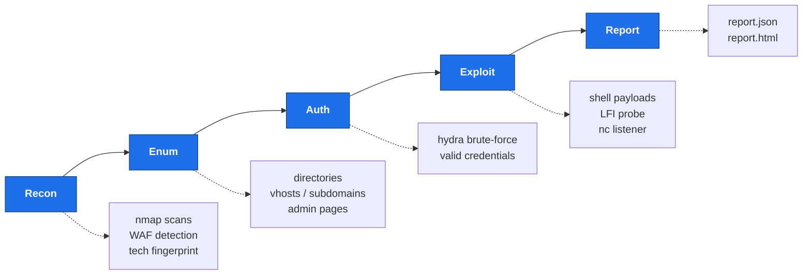
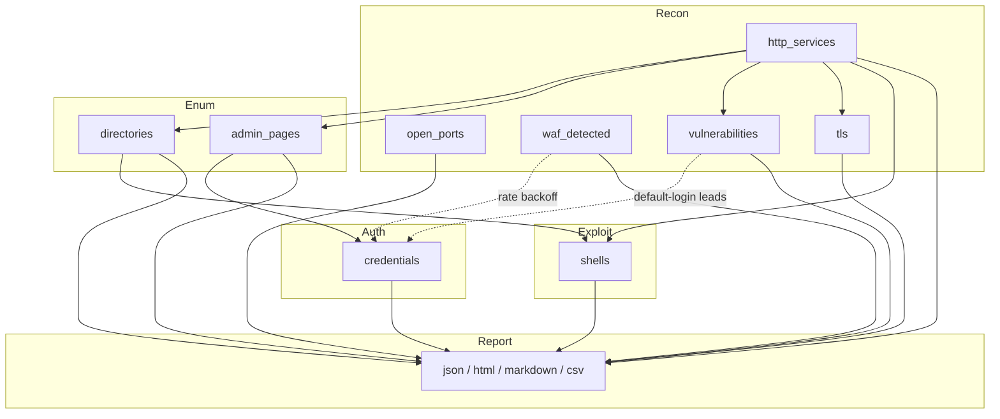
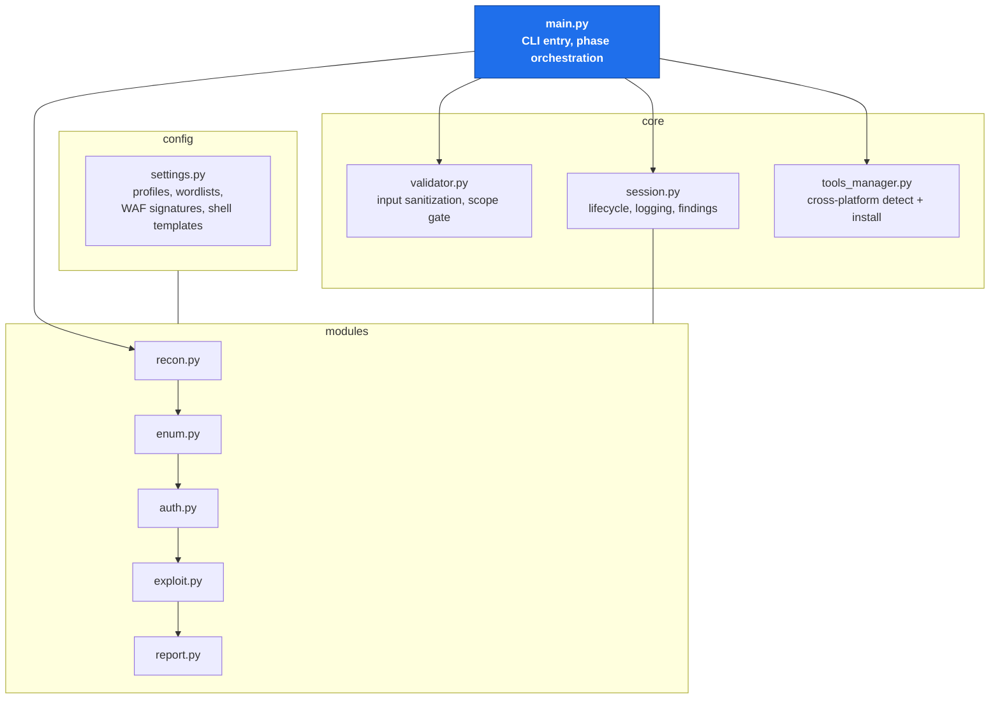
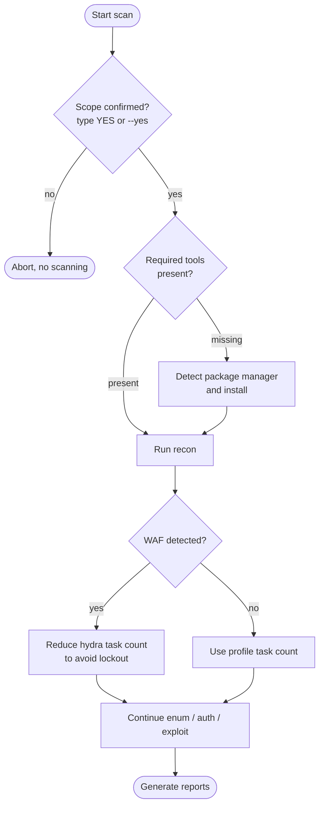

# web_csan
### Web Enumeration and Attack Toolkit - v2.0

<div align="center">


[](https://github.com/GEPD2/web_csan_enumeration_and_attack_tool/blob/main/LICENSE)


*A modular, stealth-aware web penetration testing framework for authorized security assessments*

</div>

---

> **Legal Notice** - This tool is for **authorized security testing only**.
> Use it exclusively on systems you own or have **explicit written permission** to test.
> Unauthorized use is illegal and may result in criminal prosecution.
> The authors assume no liability for misuse.

---

## What is web_csan?

web_csan is a structured penetration testing toolkit that automates the web application assessment workflow - from initial reconnaissance to credential brute-forcing and reverse shell staging. It was built to replace ad-hoc command chaining with a clean, modular, session-aware architecture that handles the operational details so you can focus on the assessment.

The tool evolved from a single-script proof-of-concept into a fully modularized framework with:

- **Cross-platform tool detection and installation** - auto-installs missing dependencies using the correct package manager for your OS and distro
- **4 stealth profiles** - from ghost mode (IDS evasion) to aggressive (lab speed)
- **Session management** - every scan gets a timestamped output directory, structured JSON event log, and automatic cleanup
- **Input sanitization** - all user input validated and injection-protected before touching subprocess
- **Multi-target support** - scan a list of targets from a file, each with its own session
- **Dual-format reporting** - machine-readable JSON plus self-contained HTML report per scan

---

## The Pipeline

web_csan runs as a five-phase pipeline. Each phase is independently runnable, and each writes its artifacts into the session directory as it goes.



Run the whole chain, or select phases with `--phase` and `--skip-*` flags. See [Usage](#usage).

---

## How Findings Flow

The phases are coupled through a single shared session state - `session.findings`. Each phase reads what earlier phases discovered and appends its own results. This forward accumulation is what lets enum target real HTTP services, auth target real admin pages, and the report summarize everything.



---

## Architecture



Directory layout:

```
web_csan/
|- main.py                  <- CLI entry point, phase orchestration
|- config/
|   +- settings.py          <- All configurable parameters (stealth profiles,
|                               wordlists, WAF signatures, shell templates, etc.)
|- core/
|   |- validator.py         <- Input sanitization, scope enforcement, injection prevention
|   |- session.py           <- Session lifecycle, structured logging, artifact tracking
|   +- tools_manager.py     <- Cross-platform tool detection and installation
+- modules/
    |- recon.py             <- nmap, HTTP probing, WAF detection, banner grabbing
    |- enum.py              <- gobuster dir/vhost/dns enumeration
    |- auth.py              <- Hydra brute-force, credential validation
    |- exploit.py           <- Shell payload generation, LFI probe, nc listener
    +- report.py            <- JSON plus HTML report generation
```

Each phase is independently runnable - you can execute only the modules you need for a given engagement.

---

## Runtime Decision Flow

Beyond the linear phase order, web_csan makes several runtime decisions - a scope confirmation gate, on-demand tool installation, and WAF-aware rate backoff - that shape how a scan actually executes.



---

## Capabilities

### Recon Phase (`modules/recon.py`)

Recon integrates the industry-standard recon stack and falls back to built-in probes when a tool is absent - so it never hard-fails, but gets far richer when the real tools are present.

- **nmap** service/version scan with stealth-profile timing (`-T1` through `-T4`), plus depth-driven NSE scripts (`http-enum`, `http-title`, `http-headers`, `http-methods`, and `vuln` at deep)
- **httpx** (ProjectDiscovery) - fast, accurate probing: status, page title, technologies, web server, CDN, and TLS metadata in one pass. Automatically detects and rejects the Python `httpx` HTTP client that shares the same binary name, preferring `httpx-toolkit`
- **whatweb** - deep technology fingerprinting, aggression scaled by stealth profile
- **wafw00f** - authoritative WAF fingerprinting (names the specific product); feeds the auth phase's rate backoff
- **nuclei** - template-based scanning for technologies, exposures, misconfigurations, default logins, and CVEs, gated by recon depth
- **sslscan** - TLS / cipher / certificate assessment on HTTPS services; flags legacy protocols, weak ciphers, expired certs, and SANs that leak internal hostnames
- Built-in fallbacks: HTTP/HTTPS probing, 3-layer WAF detection (header, body, status-code), active WAF evasion probe, technology regex fingerprinting, raw TCP banner grabbing

**Recon depth** (`--recon-depth`) controls how much active scanning runs:

| Depth | What it adds | Use for |
|---|---|---|
| `light` | httpx + whatweb + wafw00f + nuclei `tech` | Fast triage of many boxes |
| `standard` (default) | + nuclei `exposure,misconfig,default-login`, http NSE, TLS | Most lab boxes and assessments |
| `deep` | + nuclei CVE templates, nmap `vuln` NSE | Thorough, authorized, loud engagements |

### Enum Phase (`modules/enum.py`)
- **gobuster dir** - directory and file enumeration with extension fuzzing
- **gobuster vhost** - virtual host discovery
- **gobuster dns** - subdomain enumeration (domain targets only)
- Admin/login page detection via regex (15+ path patterns)
- Sensitive file flagging: `.bak`, `.env`, `.sql`, `.config`, API endpoints, `.git`
- Stealth profile controls threads and inter-request delay

### Auth Phase (`modules/auth.py`)
- Hydra `http-post-form` brute-force with auto-detected failure strings
- Hydra HTTP Basic Auth (401 targets)
- WAF-aware rate limiting - auto-reduces task count if WAF was detected
- Credential validation via live login replay after discovery
- Wordlist resolution: configured paths, then built-in defaults (no hard crashes)

### Exploit Phase (`modules/exploit.py`)
- **7 shell payload types** generated simultaneously:

| Type | Use Case |
|---|---|
| `php_exec` | Web shell via GET parameter (`?cmd=id`) |
| `php_reverse` | PHP fsockopen reverse shell |
| `bash_reverse` | `/dev/tcp` bash reverse shell |
| `python_reverse` | Python3 socket reverse shell |
| `nc_reverse` | Netcat with `-e` flag |
| `nc_mkfifo` | Netcat via `mkfifo` (no `-e` needed) |
| `powershell_reverse` | Windows PowerShell reverse shell |

- Upload path suggestion from enum discoveries
- LFI probe (5 encoded payloads, regex-confirmed hits)
- Interactive `nc -nlvp` listener with subprocess (interactive shell output)

### Report Phase (`modules/report.py`)

Four output formats, generated together by default:

- **JSON** - structured findings dump with full event log, metadata, timestamps, and a severity breakdown
- **HTML** - self-contained operator dashboard (no CDN, works air-gapped): inline-SVG charts (severity donut, attack-surface bars), summary tiles, severity-color-coded collapsible sections, overall risk badge
- **Markdown** - engagement / CTF writeup, paste-ready into notes (Obsidian, Cherrytree, etc.)
- **CSV** - one flat findings table (category, severity, name, location, detail, source) for spreadsheets and pivoting

All charts are hand-rendered inline SVG - no JavaScript, no external chart library - so the HTML report renders anywhere.

---

## Stealth Profiles

| Profile | nmap Timing | Threads | Delay | Use Case |
|---|---|---|---|---|
| `ghost` | T1 | 5 | 500ms | Maximum IDS evasion, slow |
| `stealth` | T2 | 10 | 200ms | Balanced - default |
| `normal` | T3 | 20 | none | Standard assessment |
| `aggressive` | T4 | 50 | none | Isolated lab environments |

---

## Installation

**Clone the repository:**
```bash
git clone https://github.com/GEPD2/web_csan_enumeration_and_attack_tool.git
cd web_csan_enumeration_and_attack_tool
```

**Requirements:**
- Python 3.10+ (standard library only - no `pip install` needed for the tool itself)
- **Mandatory** external tools: `nmap`, `gobuster`, `hydra`, `curl`, `grep`
- **Optional** recon tools (recon degrades gracefully without them, but is far richer with them): `httpx` (ProjectDiscovery), `whatweb`, `wafw00f`, `nuclei`, `sslscan`, `nc`

On first run the tool detects what is missing and offers to install it with your system's native package manager.

**Tool installation is handled automatically:**

| Tool group | Install path |
|---|---|
| nmap / hydra / curl / grep / sslscan / whatweb | native package manager (see table below) |
| gobuster / httpx / nuclei | `go install` (reliable cross-distro; avoids repo name clashes) |
| wafw00f | `pipx` (or `pip --user`) |

| OS / Distro | Package Manager Used |
|---|---|
| Kali / Parrot / Ubuntu / Debian | `apt` |
| Fedora / RHEL / CentOS / Rocky | `dnf` / `yum` |
| Arch / Manjaro / BlackArch | `pacman` |
| openSUSE | `zypper` |
| Void Linux | `xbps-install` |
| Alpine | `apk` |
| Solus | `eopkg` |
| macOS | `brew` (Homebrew) |
| Windows | `winget`, then `choco`, then `scoop` |

> **httpx name collision** - ProjectDiscovery's `httpx` scanner shares its binary name with the Python `httpx` HTTP client (pip). If the Python one is on your PATH, web_csan detects it, warns, and falls back to the built-in prober. Install the real scanner as `httpx-toolkit` (`apt install httpx-toolkit` on Kali) or via `go install github.com/projectdiscovery/httpx/cmd/httpx@latest`. After installing nuclei, run `nuclei -update-templates` once.

---

## Usage

```bash
# Single target - all phases - default stealth profile
python3 main.py -t 10.10.10.10

# Target by domain
python3 main.py -t target.com

# Specify stealth profile and port scope
python3 main.py -t 10.10.10.10 --profile ghost --ports full

# Scan a service on a non-standard port (scheme auto-detected)
python3 main.py -t 10.10.10.10 --port 8420 --phase recon

# Several specific ports
python3 main.py -t 10.10.10.10 --port 8080,8443,9000

# Fast recon-only triage (light depth), markdown notes out
python3 main.py -t 10.10.10.10 --phase recon --recon-depth light --report markdown

# Deep recon: nuclei CVE templates + nmap vuln NSE + TLS
python3 main.py -t 10.10.10.10 --recon-depth deep

# Run only recon and enumeration phases
python3 main.py -t 10.10.10.10 --phase recon,enum

# Multi-target from file
python3 main.py -T targets.txt --profile stealth

# Large wordlist, skip exploit phase, JSON report only
python3 main.py -t 10.10.10.10 --wordlist large --skip-exploit --report json

# Automation mode (skip scope confirmation prompt)
python3 main.py -t 10.10.10.10 --yes
```

### All Options

```
Targets:
  -t IP/DOMAIN        Single target (IPv4 address or domain name)
  -T FILE             File with one target per line

Stealth:
  --profile PROFILE   ghost | stealth | normal | aggressive  (default: stealth)
  --ports PROFILE     web_only | common | full               (default: web_only)

Recon:
  --port PORTS        Scan specific port(s), e.g. 8420 or 8080,8443
                      (alias: --target-port; overrides --ports; scheme auto-detected)
  --recon-depth DEPTH light | standard | deep                (default: standard)

Phase Control:
  --phase PHASES      Comma-separated: recon,enum,auth,exploit,report
  --skip-recon        Skip recon phase
  --skip-enum         Skip enumeration phase
  --skip-auth         Skip auth brute-force phase
  --skip-exploit      Skip exploit staging phase

Enumeration:
  --wordlist SIZE     small | medium | large                  (default: medium)
  --no-vhost          Skip virtual host enumeration
  --no-subdomain      Skip subdomain enumeration
  --skip-waf-probe    Skip active WAF evasion probe

Output:
  --report FORMAT     json | html | markdown | csv | all      (default: all)

Misc:
  --yes               Auto-confirm scope (bypass safety prompt)
  --debug             Enable debug output
```

---

## Output Structure

Each scan creates a timestamped session directory:

```
~/web_csan_output/
+- 10_10_10_10_20250219_143022/
    |- session.json         <- structured event log (JSON Lines)
    |- nmap/
    |   |- initial_scan.txt
    |   +- initial_scan.xml
    |- recon/
    |   |- targets.txt          <- URL list fed to httpx / nuclei
    |   |- httpx.jsonl          <- httpx probe output
    |   |- whatweb.json         <- whatweb fingerprint output
    |   |- wafw00f.json         <- WAF detection output
    |   +- nuclei.jsonl         <- nuclei findings
    |- gobuster/
    |   |- dir_enum.txt
    |   |- vhost_enum.txt
    |   +- subdomain_enum.txt
    |- hydra/
    |   |- form_results.txt
    |   +- usernames.txt
    |- shells/
    |   |- shell_php_exec.php
    |   |- shell_php_reverse.php
    |   |- shell_bash_reverse.sh
    |   |- shell_python_reverse.py
    |   |- shell_nc_mkfifo.sh
    |   +- shell_powershell_reverse.ps1
    +- report/
        |- report.json
        |- report.html
        |- report.md
        +- report.csv
```

---

## Tutorial - A Guided Walkthrough

This walkthrough takes you from a clean checkout to a full report. It assumes an authorized lab target such as a Hack The Box or TryHackMe machine at `10.10.10.10`.

### Step 0 - Authorization

Only scan systems you own or have explicit written permission to test. web_csan makes you confirm scope by typing `YES` before any active scanning. This is not a formality - treat it as the checkpoint it is.

### Step 1 - Get the code and check your tools

```bash
git clone https://github.com/GEPD2/web_csan_enumeration_and_attack_tool.git
cd web_csan_enumeration_and_attack_tool
python3 main.py -t 10.10.10.10
```

On first run the tool prints a tool-availability table and offers to install anything missing. Mandatory tools (`nmap`, `gobuster`, `hydra`, `curl`, `grep`) block the run until present; optional recon tools (`httpx`, `whatweb`, `wafw00f`, `nuclei`, `sslscan`) only reduce functionality if absent. Accept the install prompt, or install them yourself (see [Installation](#installation)).

### Step 2 - Your first scan (recon only)

Start small. Run just the recon phase at light depth to see the target's surface fast:

```bash
python3 main.py -t 10.10.10.10 --phase recon --recon-depth light
```

What happens, in order:

1. **nmap** finds open ports and web services.
2. The built-in prober confirms which HTTP/HTTPS services are live.
3. **httpx** enriches each service with status, title, technologies, CDN, and TLS.
4. **whatweb** adds a deeper technology fingerprint.
5. **wafw00f** names any WAF in front of the app.
6. **nuclei** (tech templates) identifies the stack precisely.

Open the HTML report to see it all charted:

```bash
xdg-open ~/web_csan_output/10_10_10_10_*/report/report.html
```

### Step 3 - Read the map, then go deeper

The recon report is an attack-surface map. Typical leads and how to chase them:

| What you see | What it means | Next move |
|---|---|---|
| `wp-login.php`, `CMS:WordPress` | WordPress admin panel | `--recon-depth standard` for CMS exposures; then the auth phase |
| Exposed `.git` / `.env` (nuclei) | Leaked source or secrets | Pull and inspect it manually |
| A named WAF (wafw00f) | Requests are being filtered | Expect the auth phase to auto-throttle hydra |
| TLS SAN `dev.internal` (sslscan) | Hidden internal hostname | Add it as a vhost in the enum phase |
| Outdated server version | Possible known CVE | `--recon-depth deep` to run CVE templates |

Go deeper when a lead justifies it:

```bash
python3 main.py -t 10.10.10.10 --recon-depth deep
```

### Step 4 - Run the full chain

When you are ready to let every phase run (recon, enum, auth, exploit, report):

```bash
python3 main.py -t 10.10.10.10 --profile stealth --recon-depth standard
```

- **enum** brute-forces directories, vhosts, and subdomains, flagging admin pages and sensitive files.
- **auth** runs hydra against discovered login forms, backing off automatically if a WAF was detected.
- **exploit** stages reverse-shell payloads and probes for LFI.
- **report** writes all four formats (JSON, HTML, Markdown, CSV).

### Step 5 - Use the reports

- **HTML** - open in a browser for the charted dashboard and risk badge.
- **Markdown** - paste `report.md` straight into your engagement notes or CTF writeup.
- **CSV** - load `report.csv` into a spreadsheet to sort/filter findings by severity.
- **JSON** - feed `report.json` to other tooling; it carries the full event log.

### Common recipes

```bash
# Quiet as possible (IDS-sensitive target)
python3 main.py -t 10.10.10.10 --profile ghost --recon-depth light

# Loud lab box, everything on, all reports
python3 main.py -t 10.10.10.10 --profile aggressive --recon-depth deep

# Sweep a list of targets, recon only, markdown notes each
python3 main.py -T targets.txt --phase recon --report markdown

# Non-interactive (CI / scripted) - skips the scope prompt
python3 main.py -t 10.10.10.10 --yes
```

### Running the tests

```bash
python3 -m unittest tests.test_web_csan -v          # offline, no tools/network needed
WEB_CSAN_LIVE_TESTS=1 python3 -m unittest tests.test_web_csan   # + live tool checks
```

### Troubleshooting

| Symptom | Cause / fix |
|---|---|
| "httpx on PATH is the Python HTTP client" | The pip `httpx` shadows the scanner. Install `httpx-toolkit` or the ProjectDiscovery `go install` build. Recon still runs on the built-in prober. |
| nuclei finds nothing / errors on templates | Run `nuclei -update-templates` once. |
| Recon phase is slow | Lower the depth (`--recon-depth light`) or the profile aggression; `deep` runs CVE templates and nmap `vuln` NSE. |
| Service on a non-standard port not found | The default port profiles only cover common web ports. Point the scan at it directly with `--port 8420` (http/https is auto-detected). |
| wafw00f install fails (PEP 668) | The installer retries with `pipx` / `pip --user --break-system-packages` automatically; otherwise `pipx install wafw00f`. |
| "This tool requires Linux" | The external tools are Linux-native; use WSL2 with Kali on Windows. |

---

## Security Design

- **Zero `os.system()` calls** - all subprocess invocations use argument lists (`subprocess.run([...])`) eliminating shell injection entirely
- **Input validation on every user-supplied value** - IP, domain, URL, port, path, all validated and sanitized before touching any subprocess or filesystem call
- **Scope confirmation gate** - requires typing `YES` explicitly before any active scanning begins
- **Graceful SIGINT handling** - Ctrl+C flushes session log and exits cleanly, with no dangling temp files
- **WAF-aware brute-forcing** - automatically backs off hydra rate when WAF is detected to avoid lockout

---

## Development Status

| Module | Status |
|---|---|
| `config/settings.py` | Complete |
| `core/validator.py` | Complete |
| `core/session.py` | Complete |
| `core/tools_manager.py` | Complete - cross-platform |
| `modules/recon.py` | Complete - httpx / whatweb / wafw00f / nuclei / sslscan + depth control |
| `modules/enum.py` | Complete |
| `modules/auth.py` | Complete |
| `modules/exploit.py` | Complete |
| `modules/report.py` | Complete - JSON / HTML (charts) / Markdown / CSV |
| `main.py` | Complete |
| `tests/` | Offline unittest suite + optional live integration |

**Done recently:**
- [x] Real-world recon tool integration (httpx, whatweb, wafw00f, nuclei, sslscan)
- [x] Recon depth control (light / standard / deep)
- [x] nmap NSE http + vuln scripts
- [x] TLS / cipher assessment
- [x] Charted HTML report + Markdown and CSV output formats

**Planned:**
- [ ] Cookie/session-based auth support
- [ ] Dedicated SQLi detection probe module
- [ ] Concurrent multi-target scanning (ThreadPoolExecutor)
- [ ] SOCKS proxy / Tor routing for ghost-mode operations
- [ ] Subdomain recon tools (subfinder / amass) in the enum phase
- [ ] Plugin system for custom modules

---

## Contributing

Pull requests are welcome. For significant changes, open an issue first to discuss the direction. Please follow the existing module structure and ensure all user input passes through `core/validator.py` before reaching any subprocess call.

---

## License

MIT License - see `LICENSE` for details.

---

<div align="center">
<sub>Built for security professionals. Use responsibly.</sub>
</div>
